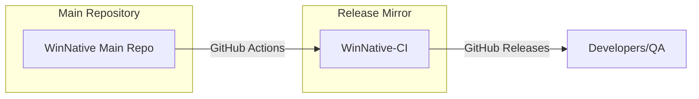

# Repository Architecture

The `WinNative-CI` repository acts as a specialized distribution point for automated builds. It is part of a two-repo architecture designed to separate source code from heavy build artifacts.

## System Overview

## Mirroring Workflow

1.  **Build Trigger**: A developer pushes code or updates a Pull Request in the main `WinNative` repository.
2.  **CI Execution**: GitHub Actions in the main repository compile the project and generate APKs.
3.  **Deployment**: The CI agent uses a specialized token to push these artifacts to `WinNative-CI`.
4.  **Release Mapping**:
    - Each Pull Request in the main repo maps to a **Release** in this repo.
    - Release tags are named based on the PR (e.g., `pr-123`).
    - Artifacts are updated in-place for the same PR to avoid release clutter.

## Rationale

- **Performance**: Keeps the main repository clone size small by not storing binary APKs in Git history.
- **Organization**: Provides a clean, dedicated UI for QA and testers to find APKs without navigating CI logs.
- **Accessibility**: Allows external stakeholders to download latest builds via the GitHub Releases interface.
